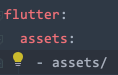
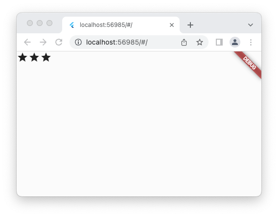
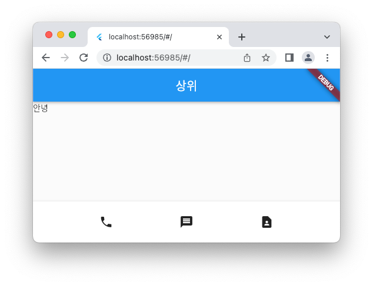
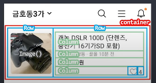
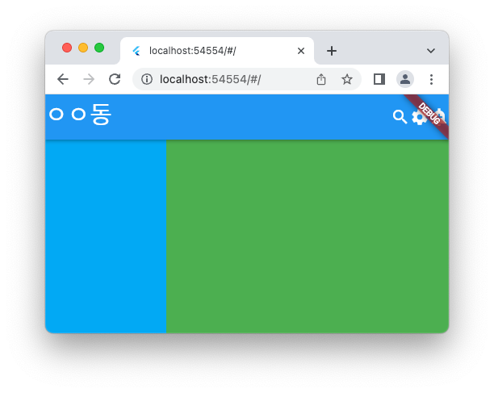
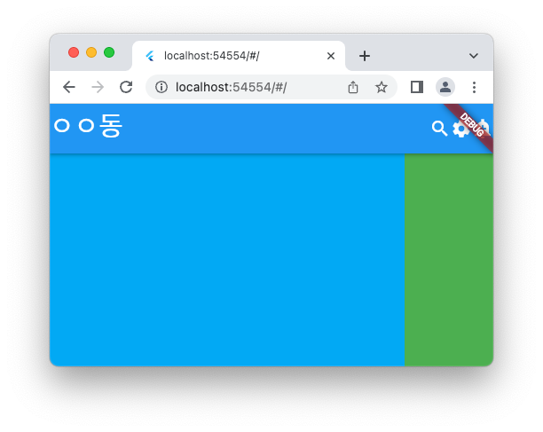

# Flutter 사용법 정리

#### `Text()`
글자 넣을때 사용

#### `Icon(Icons.아이콘이름)`
아이콘 넣을때 사용

#### `Image.asset('이미지경로')`
이미지 넣을때 사용

이미지 보관용 `assets`폴더 만들고 그 안에 이미지 넣기

이미지 사용시 사용하겠다고 등록해야됨!!
`pubspec.yaml` 파일: 앱 만들때 필요한 모든 자료를 정리한 파일, 외부 패키지도 기록
`flutter`: 밑에 `assets:` 라고 코드 작성

`assets/` 라고 작성하면 assets 폴더 안에 있는 모든 데이터를 사용하겠다는 의미


#### `Container()` or `SizedBox()`
네모 박스를 넣을때 사용
`Container( width: 50, height: 50, color: Colors.blue)` 이런식으로 사용 가능
flutter의 사이즈 단위는 LP

#### `Center()`
내 자식 위젯의 기준점을 중앙으로 설정해줌
```dart
    return MaterialApp(
      home: Center(
        child: Container( width: 50, height: 50, color: Colors.blue),
      )
    );
```

```text
위젯( child: 위젯() )
```
 형식이라고 볼 수 있다!

#### 1강 완성물


---
 
#### `MaterialApp()`
Material 테마를 이용해서 앱을 쉽게 만들 수 있게 도와주는 함수
유용한 UI들 사용 가능
커스터마이징하고 싶을때에도 사용 가능

#### `Scaffold()`
앱을 상중하로 나눠줌

#### `Row( children: [] )`
여러 위젯을 가로로 배치하는 법
```dart
body: Row(
          children: [
            Icon(Icons.star),
            Icon(Icons.star),
            Icon(Icons.star),
          ]
        ),
```


세로로 배치하고 싶을때에는 `Row` 대신 `Column` 사용하면 됨.

#### `mainAxisAlignment: MainAxisAlignment.원하는정렬형태`
(Row일때 mainAxis는 가로축)
center: 중앙정렬하고 싶을때
spaceEvenly: 일정위한 간격을 주고 싶을때 (flex와 유사)

#### `crossAxisAlignment: CrossAxisAlignment.원하는정렬형태`
(Row일때 crossAxis는 세로축)

> 자동완성은 control+spacebar 누르면 뜬다!

#### `BottomAppBar` 높이 조절 방법
Container 또는 Sizedbox 로 감싸주면 된다
SizedBox는 Container보다 가벼워서 width, height, child만 필요할때 사용하면 된다.


#### 2강 완성물


---

#### Box deco 하는 법
decoration: BoxDecoration() 사용하기

#### 박스 위치 정렬
Center, Align 등등으로 감싸기

#### 박스 가로로 꽉 채우기
width: double.infinity


---

#### 글자 디자인하는 법
`style: TextStyle()`

색 넣어주는 법
1. `Colors.컬러명`
2. `Color(0xffaaa)`
3. `Color.fromRGBO()`

글자 크기: `fontSize: 00`

자간: `letterSpacing: 00`

글자 두께: `fontWeight: FontWeight.w700`
w700: 100~900까지 조정 가능

#### 아이콘 디자인하는 법
color, size 만 디자인 가능


#### 버튼 디자인하는 법
- TextButton()
- IconButton()
- ElevatedButton() : 공중에 띄워진 느 ㅁ
중 택 1

버튼 안에는 child: , onPressed: () {} 넣어야 잘 보인다.
```dart
        body: SizedBox(
          child: ElevatedButton(
            child: Text("text"),
            onPressed: () {},
            style: ButtonStyle(),
          )

        body: SizedBox(
            child: IconButton(
                icon: Icon(Icons.star),
                onPressed: () {},
            )

```

### AppBar 디자인
leading: 왼쪽에 넣을때 주로 사용
actions: 우측에 넣을때 사용

#### 레이아웃 혼자서 잘 짜는 법
1. 예시디자인 준비 (없으면 다른앱 베끼기)
2. 예시화면에 네모그리기 (빈공간 없게 네모 그리기)
3. 바깥 네모부터 하나하나 위젯으로 만들기

4. 마무리 디자인

---
### Flexible Expanded
css flex랑 비슷
```dart
        body:
          Row(
            children: [
              Flexible(child: Container(color: Colors.lightBlue,), flex: 3),
              Flexible(child: Container(color: Colors.green,), flex: 7),
            ],
          )
```
3대 7 비율로 작성

column도 마찬가지임

`Expanded`: flex가 1인 flexible 박스와 똑같음
```dart
        body:
          Row(
            children: [
              Expanded(child: Container(color: Colors.lightBlue,)),
              Container(color: Colors.green,width: 100,),
            ],
          )
```


---

#### 레이아웃용 위젯들이 너무 길다면?
-> **커스텀 위젯** 만들기

`stless` 입력하면 자동완성으로 커스텀 위젯 틀이 나온다.
1. class 작명하기
2. return문에 축약할 레이아웃 넣기
```dart
class ShopItem extends StatelessWidget {
  const ShopItem ({super.key});

  @override
  Widget build(BuildContext context) {
    return SizedBox(
      child: Text("안녕"),
    );
  }
}
```
1. 커스텀 위젯은 class로 만든다
   - class: 변수, 함수 보관함
커스텀 위젯이 되려면 class안에 변수, 함수를 많이 넣어야 한다
-> 이미 완성된 위젯 복사해서 class 만들기
2. class에 어떤 파라미터 넣을 수 있는지 정의
4. `override`: 중복 발생시 내꺼 먼저 적용해달라는 의미
5. class안에 build라는 함수 만드는 부분
   - build안 return에 축약할 위젯 넣어야 한다


> 이런거 사용할 필요없이 변수에 담아서 사용해도 된다
> -> 대신 성능 이슈 있음
> -> 변하지 않는 UI들은 변수 함수로 축약해도 상관없음

```dart
var a = SizedBox(
  child: Text("안녕"),
);  // SizedBox
```

아무거나 다 커스텀위젯화해서는 안된다
state 관리가 힘들어질 수도 있다

#### `ListView()`
- 스크롤바 생성
- `controller: ` 사용해서 스크롤 위치 감시 가능 
- 메모리 절약 가능
- ex) 쇼핑몰 상품 리스트에 주로 사용
- 


> [🔗 코딩애플: 쉽게 알려주는 플러터 강의](https://youtube.com/playlist?list=PLfLgtT94nNq1izG4R2WDN517iPX4WXH3C) 보고 정리